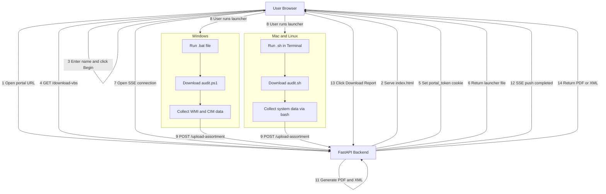
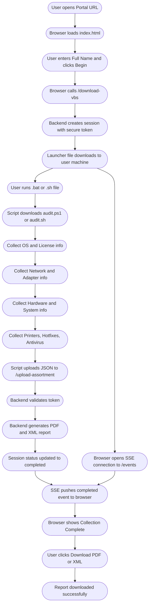

# InfraPulse — Workstation System Data Collection Portal

---

## Project Name

**InfraPulse Workstation System Data Collection Portal**

Automates collection of workstation hardware, software, network, and OS data across Windows, Mac, and Linux systems and generates a structured PDF and XML report instantly.

---

## Problem Statement

Organizations need to periodically audit workstation configurations across hundreds of systems. Doing this manually is:

- Time-consuming — IT staff visit each machine individually
- Error-prone — data entered by hand gets inconsistent
- Hard to track — no standard report format
- Platform-dependent — different tools needed for Windows vs Mac vs Linux

There was no single unified tool to collect system data from any OS and generate a standard report automatically.

---

## Solution

InfraPulse solves this by providing:

1. A web portal the user opens in any browser
2. A one-click script download that auto-detects the OS (Windows, Mac, Linux)
3. The script runs silently and collects all system data automatically
4. Data is uploaded securely to the backend
5. A PDF and XML report is generated instantly
6. The browser shows a real-time status update and a download button

No manual data entry. No IT staff required on-site. Works on any platform.

---

## Tech Stack

| Layer | Technology |
|-------|-----------|
| Backend | Python 3, FastAPI |
| PDF Generation | ReportLab |
| Data Format | JSON, XML |
| Frontend | HTML5, CSS3, Vanilla JS |
| Real-time Updates | SSE (Server-Sent Events) with Polling fallback |
| Windows Script | PowerShell with CIM and WMI |
| Mac and Linux Script | Bash with native system commands |
| Session Security | SHA-256 hashed tokens, HttpOnly cookies |
| Tunnel / Public URL | Cloudflare Tunnel or ngrok |
| Deployment | AWS EC2 or Local with Tunnel |

---

## System Architecture



The system has three main parts working together:

**1. Browser (Frontend)**
- User opens the portal URL in any browser
- Enters Full Name and clicks Begin
- Downloads a launcher script (.bat for Windows, .sh for Mac/Linux)
- Stays connected via SSE to receive live status updates
- Downloads the final PDF/XML report when complete

**2. FastAPI Backend (Server)**
- Serves the portal web page
- Creates a secure session with hashed tokens
- Provides the launcher script download with tokens baked in
- Receives collected data from the script
- Generates PDF and XML reports
- Pushes completion event to the browser via SSE

**3. Collection Script (User Machine)**
- Downloads and runs on the user's machine
- Collects all system information locally
- Uploads the data securely to the backend
- Works on Windows (PowerShell), Mac (Bash), and Linux (Bash)

---

## Data Flow



The following steps happen in order when a user runs a collection:

**Step 1** — User opens the portal URL in their browser

**Step 2** — Browser loads the portal page served by FastAPI

**Step 3** — User enters their Full Name and clicks Begin System Data Collection

**Step 4** — Browser calls the backend to create a session and download the launcher file

**Step 5** — Backend creates a unique secure session with hashed tokens and returns the launcher (.bat or .sh)

**Step 6** — Browser opens a live SSE connection to receive real-time status updates

**Step 7** — User runs the launcher file on their machine

**Step 8** — Launcher downloads the full collection script (audit.ps1 or audit.sh) from the backend with tokens embedded

**Step 9** — Script collects all system data including OS info, network, printers, hotfixes, hardware details

**Step 10** — Script uploads the collected JSON data to the backend

**Step 11** — Backend validates the token, generates PDF and XML reports, and saves them

**Step 12** — Backend updates session status to completed and pushes an SSE event to the browser

**Step 13** — Browser receives the completion event and shows the Download Report button

**Step 14** — User clicks Download PDF or Download XML to get the report

---

## What Data is Collected

**Collection Details**
- Full Name of the person running the collection
- Date and Time of collection
- Consent statement

**Network Information**
- Primary MAC Address
- IPv4 Address, Subnet Mask, Default Gateway
- IPv6 Address, Temporary IPv6, Link-local IPv6
- DHCP Enabled status and DHCP Server
- DNS Servers

**System Information**
- Computer Name
- System Manufacturer and Model
- Processor name and speed
- Total Physical Memory (RAM)
- BIOS Version
- OS Name, Version, and Architecture
- Windows License Status
- Windows Directory path
- System Boot Time
- Time Zone
- Domain
- Logon Server
- Registered Owner

**OS Update Details**
- List of all installed Hotfixes
- Hotfix ID, Description, and Install Date for each

**Drive Details**
- CD/ROM Drive name and status

**Antivirus**
- All detected antivirus product names

**Printer Details**
- Printer Name
- Printer Type (Physical or Virtual)
- System Name, Port Name, BIDI status
- Total count of connected printers

---

## How to Run the Project

### Prerequisites

- Python 3.10 or higher
- pip package manager
- Git
- Cloudflare Tunnel (cloudflared) or ngrok for public access

---

### 1. Clone the Repository

```bash
git clone https://github.com/TR0J49/OS-data-collection-.git
cd OS-data-collection-
git checkout nikky
```

---

### 2. Set Up Python Environment

```bash
python3 -m venv venv
```

Activate on Mac or Linux:
```bash
source venv/bin/activate
```

Activate on Windows:
```bash
venv\Scripts\activate
```

---

### 3. Install Dependencies

```bash
cd backend
pip install -r requirements.txt
cd ..
```

---

### 4. Start the Backend Server

```bash
uvicorn backend.main:app --host 0.0.0.0 --port 8000 --reload
```

Server runs at: `http://localhost:8000`

---

### 5. Expose Publicly via Cloudflare Tunnel

Open a new terminal window and run:

```bash
cloudflared tunnel --url http://localhost:8000
```

You will see a public URL like:
```
https://punk-audit-pathology-drinks.trycloudflare.com
```

Share this URL with all users whose systems need to be audited.

---

## How Users Run the Collection

---

### Windows

1. Open the portal URL in any browser
2. Enter your Full Name and click Begin System Data Collection
3. A .bat file downloads automatically to your Downloads folder
4. Double-click the .bat file to run it
5. A hidden PowerShell window runs in the background silently
6. Wait for the browser to show Collection Complete (15 to 60 seconds)
7. Click Download PDF Report to get your report

Note: If Windows SmartScreen appears, click More info and then Run anyway.

---

### Mac — Step by Step

**Step 1** — Open the portal URL in Safari or Chrome

**Step 2** — Enter your Full Name and click Begin System Data Collection

**Step 3** — A .sh file downloads to your Downloads folder

**Step 4** — Open Terminal
- Press Command + Space on your keyboard
- Type Terminal and press Enter

**Step 5** — Navigate to your Downloads folder
```bash
cd ~/Downloads
```

**Step 6** — Make the script executable
```bash
chmod +x verify_system_*.sh
```

**Step 7** — Run the script
```bash
bash verify_system_*.sh
```

**Step 8** — Wait 15 to 30 seconds while data is collected silently

**Step 9** — Go back to the browser. You will see Collection Complete.

**Step 10** — Click Download PDF Report to get your report

#### Mac Troubleshooting

| Issue | Fix |
|-------|-----|
| Permission denied error | Run `chmod +x verify_system_*.sh` first |
| Gatekeeper blocks the script | Use `bash verify_system_*.sh` instead of `./verify_system_*.sh` |
| Script not found | Make sure you are in Downloads folder. Run `ls *.sh` to confirm |
| Browser shows spinner forever | Refresh page, re-download the file and run again |
| Script runs but nothing happens | Check your internet connection and try again |

---

### Linux — Step by Step

**Step 1** — Open the portal URL in Firefox or Chrome

**Step 2** — Enter your Full Name and click Begin System Data Collection

**Step 3** — A .sh file downloads to your Downloads folder

**Step 4** — Open Terminal
- On Ubuntu press Ctrl + Alt + T
- Or search for Terminal in the application launcher

**Step 5** — Navigate to your Downloads folder
```bash
cd ~/Downloads
```

**Step 6** — Make the script executable
```bash
chmod +x verify_system_*.sh
```

**Step 7** — Run the script
```bash
bash verify_system_*.sh
```

**Step 8** — Wait 15 to 30 seconds while data is collected silently

**Step 9** — Go back to the browser. You will see Collection Complete.

**Step 10** — Click Download PDF Report to get your report

#### Linux Package Requirements

The script uses standard Linux tools. Install them if missing:

On Debian or Ubuntu:
```bash
sudo apt install curl net-tools -y
```

On RHEL, CentOS, or Fedora:
```bash
sudo yum install curl net-tools -y
```

#### Linux Troubleshooting

| Issue | Fix |
|-------|-----|
| curl command not found | Run `sudo apt install curl -y` |
| Permission denied error | Run `chmod +x verify_system_*.sh` |
| No data in report | Run the script manually in terminal and check for errors |
| File not found | Check filename with `ls ~/Downloads/*.sh` |
| Browser shows spinner forever | Refresh page, re-download the file and run again |

---

## Project Folder Structure

```
OS-data-collection-/
├── backend/
│   ├── main.py              FastAPI backend with all endpoints and PDF/XML generation
│   └── requirements.txt     Python dependencies
├── frontend/
│   └── index.html           Single-page portal UI
├── scripts/
│   ├── audit.ps1            Windows PowerShell data collection script
│   └── audit.sh             Mac and Linux bash data collection script
├── user_info/               Generated reports saved here (PDF, XML, JSON)
├── logs/                    Backend application logs
├── amplify.yml              AWS Amplify build configuration
└── WORKFLOW.md              This documentation file
```

---

## Security

- Raw tokens are never stored on disk. Only SHA-256 hashes are saved.
- The portal_token is set as an HttpOnly cookie and is not accessible via JavaScript
- Each session has a unique assortment_token so scripts cannot upload to the wrong session
- Sessions automatically expire after 1 hour
- All communication is over HTTPS via Cloudflare Tunnel

---

## Report Output

After collection completes, three files are saved in the user_info folder:

| File | Format | Contents |
|------|--------|----------|
| Name_timestamp.pdf | PDF | Full human-readable report with all sections |
| Name_timestamp.xml | XML | Structured machine-readable data |
| Name_timestamp.json | JSON | Raw collected data from the script |
