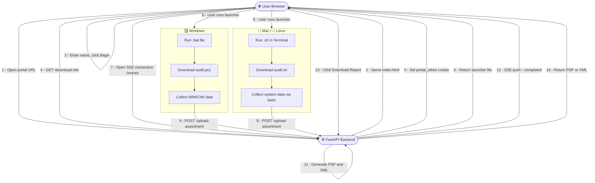
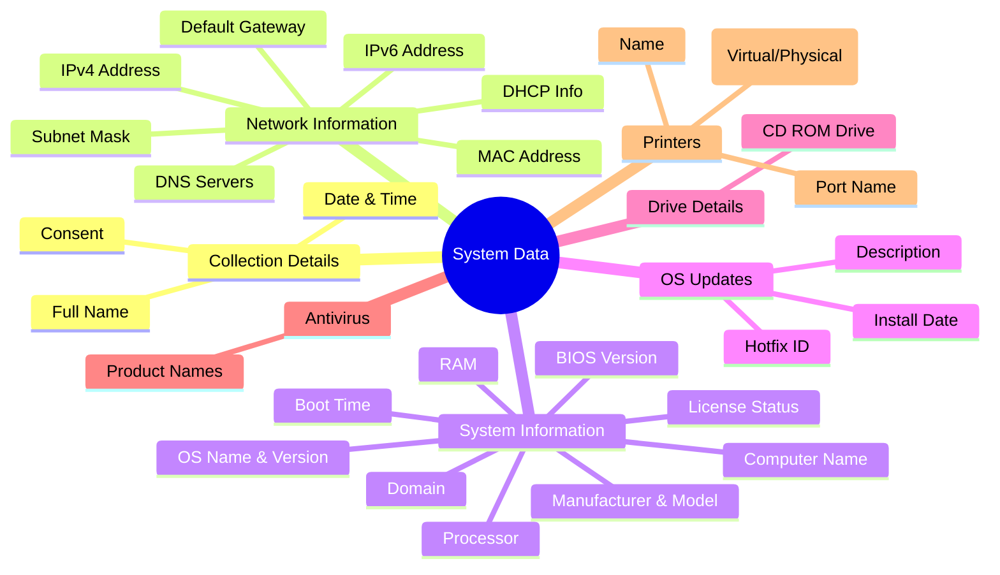

# InfraPulse — Workstation System Data Collection Portal

---

## Project Name

**InfraPulse Workstation System Data Collection Portal**
> Automates collection of workstation hardware, software, network, and OS data across Windows, Mac, and Linux systems — and generates a structured PDF + XML report instantly.

---

## Problem Statement

Organizations need to periodically audit workstation configurations across hundreds of systems. Doing this manually is:

- Time-consuming — IT staff visit each machine individually
- Error-prone — data entered by hand gets inconsistent
- Hard to track — no standard report format
- Platform-dependent — different tools needed for Windows vs Mac vs Linux

**There was no single unified tool to collect system data from any OS and generate a standard report automatically.**

---

## Solution

InfraPulse solves this by providing:

1. A **web portal** the user opens in any browser
2. A **one-click script download** that auto-detects the OS (Windows / Mac / Linux)
3. The script runs silently and **collects all system data automatically**
4. Data is uploaded securely to the backend
5. A **PDF + XML report** is generated instantly
6. The browser shows a **real-time status update** (SSE) and a download button

No manual data entry. No IT staff required on-site. Works on any platform.

---

## Tech Stack

| Layer | Technology |
|-------|-----------|
| Backend | Python 3, FastAPI |
| PDF Generation | ReportLab |
| Data Format | JSON, XML |
| Frontend | HTML5, CSS3, Vanilla JS |
| Real-time Updates | SSE (Server-Sent Events) + Polling fallback |
| Windows Script | PowerShell (CIM/WMI) |
| Mac/Linux Script | Bash (system commands) |
| Session Security | SHA-256 hashed tokens, HttpOnly cookies |
| Tunnel / Public URL | Cloudflare Tunnel / ngrok |
| Deployment | AWS EC2 / Local + Tunnel |

---

## System Architecture



---

## Data Flow

```mermaid
flowchart LR
    subgraph BROWSER["🌐 Browser"]
        B1([Open Portal URL])
        B2([Enter Full Name])
        B3([Click Begin])
        B4([File Downloads])
        B5([SSE Connection Opens])
        B6([Spinner - Waiting...])
        B7([✅ Collection Complete])
        B8([Download PDF Report])
    end

    subgraph SERVER["⚙️ FastAPI Server"]
        S1([Serve index.html])
        S2([Create Session + Token])
        S3([Return .bat or .sh])
        S4([Stream SSE Events])
        S5([Receive JSON Data])
        S6([Generate PDF + XML])
        S7([Push completed Event])
        S8([Serve PDF File])
    end

    subgraph SCRIPT["💻 Script on User Machine"]
        P1([Download audit.ps1 or audit.sh])
        P2([Collect OS Info])
        P3([Collect Network Info])
        P4([Collect System Info])
        P5([Collect Printers + Hotfixes])
        P6([Upload JSON to Server])
    end

    B1 --> S1 --> B2 --> B3
    B3 --> S2 --> S3 --> B4
    B4 --> B5 --> S4
    B4 --> P1
    P1 --> P2 --> P3 --> P4 --> P5 --> P6
    P6 --> S5 --> S6 --> S7
    S7 --> B6 --> B7 --> B8
    B8 --> S8
```



---

## What Data is Collected



---

## How to Run the Project

### Prerequisites

- Python 3.10+
- pip
- Git
- Cloudflare Tunnel (`cloudflared`) or ngrok

---

### 1. Clone the Repository

```bash
git clone https://github.com/TR0J49/OS-data-collection-.git
cd OS-data-collection-
git checkout nikky
```

---

### 2. Set Up Python Environment

```bash
# Create virtual environment
python3 -m venv venv

# Activate (Mac/Linux)
source venv/bin/activate

# Activate (Windows)
venv\Scripts\activate
```

---

### 3. Install Dependencies

```bash
cd backend
pip install -r requirements.txt
cd ..
```

---

### 4. Start the Backend Server

```bash
uvicorn backend.main:app --host 0.0.0.0 --port 8000 --reload
```

Server runs at: `http://localhost:8000`

---

### 5. Expose Publicly via Cloudflare Tunnel

Open a **new terminal window** and run:

```bash
cloudflared tunnel --url http://localhost:8000
```

You will see a public URL like:
```
https://punk-audit-pathology-drinks.trycloudflare.com
```

Share this URL with all users whose systems need to be audited.

---

## How Users Run the Script

---

### Windows

1. Open the portal URL in any browser
2. Enter your **Full Name** → click **Begin System Data Collection**
3. A `.bat` file downloads automatically
4. **Double-click** the `.bat` file
5. A hidden PowerShell window runs in the background
6. Wait for the browser to show **"Collection Complete"** (15–60 seconds)
7. Click **Download PDF Report**

> If Windows SmartScreen appears → click **More info** → **Run anyway**

---

### Mac — Step by Step

1. Open the portal URL in **Safari or Chrome**
   ```
   https://punk-audit-pathology-drinks.trycloudflare.com
   ```

2. Enter your **Full Name** → click **Begin System Data Collection**

3. A `.sh` file downloads to your **Downloads** folder

4. Open **Terminal**
   - Press `Cmd + Space` → type `Terminal` → press `Enter`

5. Navigate to Downloads
   ```bash
   cd ~/Downloads
   ```

6. Make the script executable
   ```bash
   chmod +x verify_system_*.sh
   ```

7. Run the script
   ```bash
   bash verify_system_*.sh
   ```

8. Wait 15–30 seconds — the script collects data silently

9. Go back to the browser — you will see **"Collection Complete"**

10. Click **Download PDF Report**

#### Mac Troubleshooting

| Issue | Fix |
|-------|-----|
| `Permission denied` | Run `chmod +x verify_system_*.sh` first |
| Gatekeeper blocks script | Use `bash verify_system_*.sh` instead of `./verify_system_*.sh` |
| Script not found | Make sure you're in `~/Downloads` — run `ls *.sh` to confirm |
| Portal shows spinning forever | Refresh page, re-download and re-run script |

---

### Linux — Step by Step

1. Open the portal URL in **Firefox or Chrome**
   ```
   https://punk-audit-pathology-drinks.trycloudflare.com
   ```

2. Enter your **Full Name** → click **Begin System Data Collection**

3. A `.sh` file downloads to your **Downloads** folder

4. Open **Terminal**
   - Ubuntu: `Ctrl + Alt + T`
   - Or search "Terminal" in app launcher

5. Navigate to Downloads
   ```bash
   cd ~/Downloads
   ```

6. Make the script executable
   ```bash
   chmod +x verify_system_*.sh
   ```

7. Run the script
   ```bash
   bash verify_system_*.sh
   ```

8. Wait 15–30 seconds — the script collects data silently

9. Go back to the browser — you will see **"Collection Complete"**

10. Click **Download PDF Report**

#### Linux Package Requirements

The script uses standard Linux tools. If any are missing, install them:

```bash
# Debian / Ubuntu
sudo apt install curl net-tools -y

# RHEL / CentOS / Fedora
sudo yum install curl net-tools -y
```

#### Linux Troubleshooting

| Issue | Fix |
|-------|-----|
| `curl: command not found` | `sudo apt install curl -y` |
| `Permission denied` | Run `chmod +x verify_system_*.sh` |
| No data in report | Run script manually in terminal and check for errors |
| `bash: ./verify_system_*.sh: No such file` | Check filename with `ls ~/Downloads/*.sh` |

---

## Project Folder Structure

```
OS-data-collection-/
├── backend/
│   ├── main.py              ← FastAPI backend (all endpoints, PDF/XML generation)
│   └── requirements.txt     ← Python dependencies
├── frontend/
│   └── index.html           ← Single-page portal UI
├── scripts/
│   ├── audit.ps1            ← Windows PowerShell data collection script
│   └── audit.sh             ← Mac/Linux bash data collection script
├── user_info/               ← Generated reports saved here (PDF, XML, JSON)
├── logs/                    ← Backend logs
├── amplify.yml              ← AWS Amplify build config
└── WORKFLOW.md              ← This file
```

---

## Security

- Raw tokens **never stored on disk** — only SHA-256 hashes saved in `sessions.json`
- `portal_token` set as **HttpOnly cookie** — not accessible via JavaScript
- Each session has a unique `assortment_token` — script cannot upload to wrong session
- Sessions expire after **1 hour**
- All communication over **HTTPS** via Cloudflare Tunnel

---

## Report Output

After collection, three files are saved in `user_info/`:

| File | Format | Contents |
|------|--------|----------|
| `Name_timestamp.pdf` | PDF | Full human-readable report with sections |
| `Name_timestamp.xml` | XML | Structured machine-readable data |
| `Name_timestamp.json` | JSON | Raw collected data |
